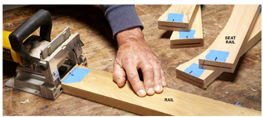

**Overview**: This set of exercises asks students to create text directions from a series of pictures and create pictures for a series of text directions. The iterations begin simply and advances through the assignments.  

**Purpose**: These exercises are meant to help students understand how images and text need to work in concert in technical writing. They should help habituate students to putting directions in order in a logical way, labeling and referring to images, writing as a team, and doing peer review. 

**Directions**: There are 3 assignments within this set of exercises, and each also has a separate peer review component. Ideally, it is meant for students working in teams. The assignments vary between asking students to work individually, asking students to work as a team, and asking students to provide peer review either individually and or in teams.   

## Assignment 1: Cake Time! 

Step 1: Each team receives a [set of images](#cake) of some of the steps for baking a cake.  

Step 2: As a team during an in-class session, outside of class meeting, or virtual meeting (using a videoconferencing platform), students should put the images in order, label them (“figure 1,” etc.), write the text directions, and intersperse the images and text directions in a document.  

Step 3: The team should submit their work.  

Optional step 4: [Cake Time peer review](#bookmark0). See directions on the file. 

## Assignment 2: Pitching a Tent 

Step 1: As individuals, students will receive either the text directions or images for either [Tent 1](#bookmark1) or [Tent 2](#bookmark2). (The instructor should divide the files so students only get the images or the text directions.)  

Step 2: On their own, each student should draw the images if they received text directions or write the text directions if they received the images. As with the last assignment, students should label all the images, intersperse the images and text directions, and submit their work.  

Step 3: Within their teams, students should then engage in the [Pitching a Tent Peer Review](#bookmark3) with another student who received the opposite part of the assignment (so students with images pair with students with text and vice versa).  

## Assignment 3: Building Furniture 

Step 1: Each team will either receive the [Chair Text and Image Directions](#bookmark4) or the [Bench Text and Image Directions](#bookmark5). (The instructor should divide the files so students only get the images or the text directions.) 

Step 2: The teams will have to craft what is missing (either images or text for either Chair or Bench) either in class together or outside of class in person or virtually. Students may write to other teams for hints. Students should submit their work. 

Step 3: The two teams that received Chair should meet with one another to look over their work. Same with the student who received Bench. This is the [first round of the Building Furniture Peer Review](#bookmark6).  

Step 4: One team of Bench and one team of Chair each should exchange their revised, complete directions (both text and images). In this [second round of the Building Furniture Peer Review](#bookmark7), students from the opposite team (chair vs. bench) will attempt to build a low-fidelity ¼” model the furniture following the directions and share their experience with their peers.  

## Assignment 4: Words and Images Reflection 

Step 1: Each individual student should write a short reflective essay that addresses each of the following prompts: 

- What have you learned about writing text-based directions?  
- What have you learned about creating images for directions? 
- What have you learned about the relationship between text and images in technical writing? 
- What differences did you notice between the pitching a tent exercise and the building furniture exercise? How did one asking you to assemble a ready-made product and the other asking you to fabricate a new item change the way the directions were written and presented?

After doing this process, what you think makes for clear directions? If you were telling someone how to create directions, what would you advise them to do?  

Optional step 2:- Have students read [this online article](https://instrktiv.com/en/ikea-manual/) about what makes good directions (with reference to Ikea) after they have written their reflection. 

For fun: 

[https://www.designboom.com/design/ikea-furniture-forts-05-14-2020/](https://www.designboom.com/design/ikea-furniture-forts-05-14-2020/)

> This work is licensed under the [Creative Commons Attribution-NonCommercial 4.0 International License](http://creativecommons.org/licenses/by-nc/4.0/). To view a copy of this license, visit [http://creativecommons.org/licenses/by-nc/4.0/](http://creativecommons.org/licenses/by-nc/4.0/)
> or send a letter to Creative Commons, PO Box 1866, Mountain View, CA 94042, USA. 

# Cake Time Directions:
The images that follow tell part of the story of making cupcakes, but there are important steps missing and the images are not in order. (The measurements and oven temperature are also missing, but do not worry about that for this exercise.)  

As a team, put the images in order and label them figure 1, figure 2, etc. Then, write the directions you think go with each image. In the directions, write “see figure X.” After you have done that, write any additional directions you think are missing. Then, put the directions and images in order on the page. Be sure to think about and play around with layout.  

Share your final version with another team. Note any differences between the choices each team made.  
### Images:
         [^1]

# Cake Time! Peer Feedback
As a team, answer the following questions about another team’s cake directions 

1. Check for some basics: 

________Is each figure labeled? 

________Do the text directions refer to each figure? 

________Are the figures and text interspersed (not all the images are at the bottom or top of the page)? 

2. Now, look for more nuanced choices and explain your reaction: 

- How did the team put the directions in order? Are they numbered or do they use page spacing or other ways to show the order? How are they different from your order? 
- What directions did they add? Why? Are those different or the same to the ones you added? 
- What other things do you notice about these directions? 

3. Share your finding with the team that authored these directions.

# Tent 1 Text and Image Directions
### Component List:
- 1 Tent Body,
- 4 Poles,
- 1 Tent Fly,
- 1 Fly Rod,
- 2 Brim Rods,
- 1 Pole Bag,
- 1 Carry Bag,
- 1 Stake Bag w/ Stakes ASSEMBLY
### Directions for Assembly:
- Lay the tent body out on the ground and open the door. In windy conditions, the windward corner of the tent should be staked down. Take all of the poles and rods out of the carry bag, assemble them and divide according to their length.
- One end of each frame pole has a larger diameter. Insert this end onto one of the arms of the spider. Make sure that it seats securely. Improper fit can cause the spider to break.
- Follow the seam from the spider, down to the corner of the tent. Make sure that the spider is properly oriented, then insert the pin on the corner ring into the other end of the pole.
- Insert the next pole onto the opposite arm on the spider. Tension this assembly by placing the corner pin in the other end of this pole. With the assembly on the ground, place a third pole into the spider and place the corner pin in the other end. Lift the spider and insert the last pole. Apply tension by inserting the corner pin into the end of this pole.
- Connect all clips and rings to the frame.
- Lay the fly out on the ground, upside down. Thread the brim rods through the sleeves on the fly. Fit the fly rod into the web pockets on the underside of the fly and secure with the Velcro tab at the center.
- Turn the fly right side up and drape it over the tent with a brim rod over each door. Wrap and secure the Velcro straps around the poles to keep the fly in place. Insert each end of a brim rod into the corresponding grommet on the tent. Set the hoods to the same height. If the fly has shifted, adjust the Velcro straps on the frame. Fasten the side release buckles at all of the corners and tension until wrinkles are gone. 8. Stake out the tent through the corner rings. Stake opposite corners while applying tension to square the tent and remove wrinkles from the floor. Stake out the fly through the rings on the side of the fly. Stake down the side pull outs to provide maximum floor space.

**Images**
 [^2]

# Tent 2 Text and Image Directions
### Directions for Assembly:
Layout & Positioning of Tent and Poles  
- Layout and position the tent with door facing desired direction.
- Stake down tent corners first through the stake rings.
- Keep the floor taut.
- Stake down the remainder of the stake rings.
- Assemble all poles by unfolding and interlocking the shock-corded pole sections.
- Insert the body poles into the pole sleeves. 

Connect Poles to Tent  
- Insert one pin into one end of the pole.
- Go to opposite end of pole and carefully insert the pin into the other pole end.
- Repeat for all poles. 

Attach Tent to Body Poles Using Clips 
- Attach clips along the edges of tent to body poles.
- Make any adjustments to the tent stakes, if needed. 

Attach Rainfly  
- Insert vestibule pole into pole sleeve located on underside of rainfly.
- Attach rainfly pole to underside of rainfly with straps and insert the tips of the rainfly pole into the pockets on underside of rainfly.
- Drape rainfly over tent.
- Secure rainfly with straps located on the underside of rainfly.
- Insert one pin into one end of the vestibule pole.
- Attach and stake out guylines.

**Images**
 [^3]

# Pitching a Tent Peer Feedback
Look at your partner’s work, and answer the following questions:  

1. Check for some basics: 

________Is each figure labeled? 

________Do the text directions refer to each figure? 

________Are the figures and text interspersed (not all the images are at the bottom or top of the page)? 
2. Now, look for more nuanced choices and explain your reaction: 
- How closely do the spirit of the images that you or your partner created match those of the official directions? (No weighing in on artistic ability.) What are the main differences? Why do you think those differences exist?  
- How closely does the text directions that you or your partner created match those of the official directions? What are the main differences? Why do you think those differences exist?  
- What other major differences exist between your two sets of directions? If you were going to create one document from your two, what choices would you make to include some of each of your work (without defaulting to the official directions)? Why?  
- What other things do you notice about the two sets of directions? 
3. Share your finding with your partner. Decide which aspects of each set of directions you would include to make a new draft of “official” directions. Be able to explain why.

# Chair Text and Image Directions
### Materials Required
- 1/8-in. x 24-in. x 48-in. Hardboard (for templates)
- 1x6 x 8 ft. cedar boards (2)
- 2-in. galvanized screws
- 2x6 x 8 ft. cedar boards (2)
- Thompson's Water Seal finish (1 pint)
- Wood glue
### Directions for Assembly
Make template
- Mark one-inch increments on both ends and one side of the hardboard.
- Draw grid lines using a combination square, straight edge and fine-point permanent marker.
- Transfer the points to your hardboard grid where the shape intersects the grid lines in the drawing.
- Draw lines connecting the points made on the grid.
- Use a smooth, arcing arm movement to draw the gradual curve.
- Use a quarter to trace the 1/2-in. radiuses at the bottom of the leg.
- Use a jigsaw to cut out the pattern.
- Align the backrest strut template to the centerline and bottom edge of the cedar piece and trace the shape.
- Flip the template along the centerline to draw the other half.
- Cut out the pieces with a jigsaw.

Use template
- Align it to centerlines drawn on the boards, trace around it, then flip it over the centerline and trace the rest of the shape.
- Sand the edges of the curved pieces with a belt sander.
- Cut all the pieces to the dimensions given in the Cutting List, using the templates for the legs and the top slat.
- Cut out the shapes with a jigsaw.
- Sand the pieces with a belt sander. 

Drill the Ends 
- Drill the ends of the hand grip holes with a 1-in. spade bit.
- Lay out the hand grip hole in the top slat, then cut it out using a jigsaw and spade bit.
- Rip the back and seat slats two inches wide using a table saw.
- Lay out, countersink and drill all the screw holes for the slats and supports.
- Sand all the pieces with 120-grit, then 150-grit sandpaper.
- Round over the sharp edges with the sandpaper. 

Align the Seat 
- Use a carpenter's square to align the seat supports 90 degrees to the backrest struts, then glue and screw them in place.
- Use glue and screws to attach the slats, too.
- Screw the two seat supports (D) and curved top slat to the backrest struts using the spacing given in Fig. A.
- Attach the five slats to the backrest struts and six slats to the seat struts.
- Attach the Slats 
- Attach the slats to the seat struts using a 1/2-in. spacer to align them.
- Finish driving the screws by hand to avoid setting their heads too deep. 

Finishing Touches 
- Before applying the finish, unscrew the two seat supports and apply weather-resistant glue (like Titebond II or Gorilla Glue) to the joints, then re-screw the seat supports to the backrest struts.
- Brush on two liberal coats of a penetrating exterior wood sealer (like Thompson's Water Seal).
- Let the first coat dry for 24 hours, then apply the second coat.
- After an hour, wipe off any excess finish.
- Let the finish dry for a couple of days before using the chair.

**Images**

 [^4]

# Bench Text and Image Directions
### Materials Required
- 2x4 x 8’ cedar
- 5.4x6 x 10 cedar decking (2)
- 1x6 x 6’ cedar (4)
- No. 20 biscuits (12)
- 2-1/2” deck screws
- 1-5/8” deck screws
- Wood glue
- ½” flattop wood plugs (40)
- Exterior wood finish
### Directions for Assembly
Cut out and drill the parts 
- Use a 1/2-in. Forstner bit to drill recesses for the screws.
- Cut the biscuit slots for the seat rails: Mark the centers of the biscuit slots on masking tape. Then, with the plug recesses facing up, cut the slots in the narrow sides of the legs. Keep the plate joiner and leg tight to the bench top as you cut. Use tape to avoid marks on the wood and to keep track of the orientation of the pieces.
- Position slots for the long rails with a spacer: Orient the leg so the previously cut slot is facing up, and cut a slot on the side opposite the plug holes. Use a spacer to position the slot so the long rail will be centered on the leg when it’s installed.
- Cut slots in the rail ends: Mark the centers of the curved seat rails and long rails on masking tape.
- Cut slots in the long rails: Position the long rails with the masking tape facing down. Use a Speed Square as a guide for cutting biscuit slots for the intermediate rails. Align the square with the edge mark for the seat rail. Make a center mark on the square as a reference for lining up the plate joiner. 

Join the rails and legs with biscuits 
- Put a biscuit in the slot and dry-fit the leg and seat rail to make sure the rail is oriented correctly. It should be centered on the leg. Then spread glue in the slots and on the biscuit and press the leg and the seat rail together. 
Complete the leg assembly and seat assemblies
- Use a spacer to support the lower rail. Then drive screws through the legs into the rail.
- Connect the seat rails with biscuits Join the two long rails with the two intermediate seat rails with biscuits and glue. Clamp them and let the glue set about 30 minutes.
- Connect the leg assembies to the seat assembly with biscuits and clamp them together. Then attach the brace with screws.
- SCREW ON THE SEAT SLATS Start by attaching the two outside slats. Then center the middle slat and attach it with screws. Next, position the remaining slats so there’s an even space (two biscuits wide) between them. Use a board to align the slat ends 

Finishing Touches 
- HIDE THE SCREWS WITH WOOD PLUGS Glue flat-top wood plugs into the plug recesses. Use a cutoff dowel or a small block of wood to pound them flush.
- Finished the bench with Cabot Australian Timber Oil.

**Images**

 [^4]

# Building Furniture Round 1 Peer Review
As a team, answer the following questions about another team’s Chair or Bench directions 

1. Check for some basics: 

________Is each figure labeled? 

________Do the text directions refer to each figure? 

________Are the figures and text interspersed (not all the images are at the bottom or top of the page)? 

2. Now, look for more nuanced choices and explain your reaction: 

- How did the team put the directions in order? Are they numbered or do they use page spacing or other ways to show the order? How are they different from your order?
- How closely do the spirit of the images that your or the other team created match those of the official directions? (No weighing in on artistic ability.) What are the main differences? Why do you think those differences exist?
- How closely do the text directions that your or the other team created match those of the official directions? What are the main differences? Why do you think those differences exist?
- What other major differences exist between your two sets of directions? If you were going to create one document from your two, what choices would you make to include some of each of your work (without defaulting to the official directions)? Why?
- What other things do you notice about the two sets of directions? 

3. Both teams should get together to share their findings. After sharing your peer review, make another set of directions using the new text and the new images that you think is the best version of the directions, using aspects from both teams’ work and trying to avoid using the “official” images and text as much as possible.

# Building Furniture Round 2 Peer Review
Now you will look at the other project and offer peer review in teams. If you worked on Bench, you will match with a Chair team (and vice versa). As you look at the Bench or Chair directions created by the team, answer the following questions. 

1. Check for some basics: 

________Is each figure labeled? 

________Do the text directions refer to each figure? 

________Are the figures and text interspersed (not all the images are at the bottom or top of the page)? 

2. For this set of questions, get some craft paper, foam core, cardboard, or other material and try to make the piece of furniture in ¼” scale to the best of your ability. Feel free to use tape or other easily accessible supplies to connect the parts to one another.  

- As you build the model, note where you had trouble with the directions here. (Be as specific as possible.)
- What images did you find helped you the most? Which ones helped you the least? Explain why.
- Based on your experience trying to follow these directions, suggest changes to the order, working, layout, images, or other aspects here.  

3. Share your finding with the team that authored these directions.  

4. What has this experience taught you about writing directions?

# References
[^1]: Linuxmom, ["How to Make Cake"](https://www.instructables.com/How-to-make-cake-2/) is licensed under [CC BY-NC-SA 4.0](http://creativecommons.org/licenses/by-nc-sa/4.0)  
[^2]: Coleman, Inc, [“Tent Setup Instructions, Model 2000004559”](https://images-eu.ssl-images-amazon.com/images/I/A1IqnG4BI%2BS.pdf)  is included with permission.  
[^3]: Eureka! [“Assembly Instruction for the Titan Tent”](https://www.eurekacamping.com/sites/eurekacamping_site/files/Archive/TITAN09IM.pdf) is included on the basis of fair use.   
[^4]: Family Handyman [“How to Build a Garden Bench”](https://www.familyhandyman.com/project/how-to-build-a-garden-bench/) and [“How to Build a Patio Chair”](https://www.familyhandyman.com/project/how-to-build-a-patio-chair/) are included on the basis of fair use.
