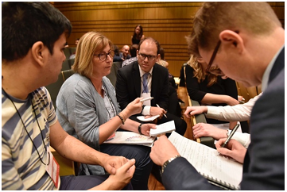
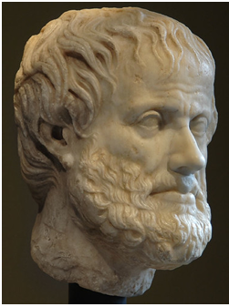
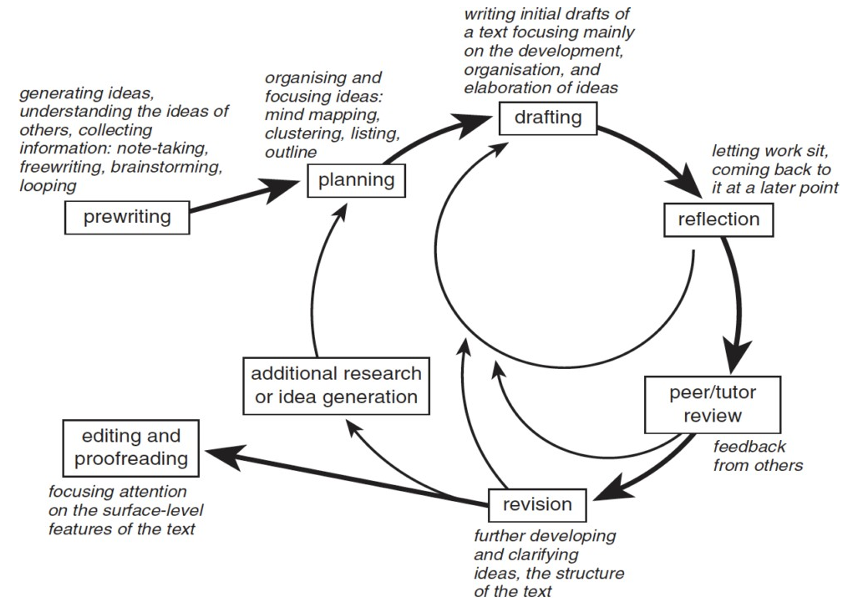
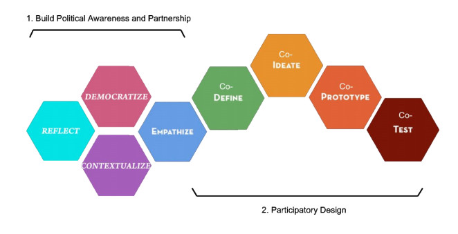

# Foundations of Technical and Professional Communication

Chapter 2

Prepared by Laura Maria Pigozzi, PhD 

Ver. 1 Aug 2020

## What is technical and professional communication?

This work is licensed under the Creative Commons Attribution-NonCommercial 4.0 International License. To view a copy of
this license, visit http://creativecommons.org/licenses/by-nc/4.0/]](http://creativecommons.org/licenses/by-nc/4.0/) or send a letter to Creative Commons, PO Box 1866, Mountain View, CA 94042, USA.

 

*In science, the credit goes to the \[person\] that convinces the
world, not to whom the idea first occurs* [^1] \~ Francis Darwin (son
of Charles Darwin)

As Francis Darwin points out, no matter how spectacular your ideas and designs are, if you can't communicate them effectively to a wide variety of audiences, they will not be recognized.

Effective communication is the vehicle to get your work documented,
legitimized, recognized, utilized.

When you hear the term *technical communication*, what comes to mind? Perhaps you think of scientific reports, specifications, instructions, software documentation, proposals, or technical manuals. Perhaps you think of writing done by engineers to document a design project. Yes, all of this. However, technical communication is more than that. Technical communication includes writing produced in day-to-day business operations such as emails, memos, meeting minutes, and a variety of reports. These day-to-day communications can be described as *business communication* or *professional communication.* And because oral and visual presentations are such an important part of professional life, technical communication also encompasses these as well. Websites and blogs are technical communication and increasingly, social media has also been included.

Specifically, technical and professional communication (TPC) involves communicating complex information to a specific audience who will use it to accomplish some goal or task. TPC provides specific information for practical and specific purposes (informing, instructing, persuading).

Engineers, especially, must be able to communicate within their teams and also be able to communicate complex information to a variety of audiences with different knowledge backgrounds. As Stephen Pinker explains,

The curse of knowledge is the single best explanation of why good people write bad prose. It simply doesn't occur to the writer that her readers don't know what she knows---that they haven't mastered the argot of her guild, can't divine the missing steps that seem too obvious to mention, have no way to visualize a scene that to her is as clear as day. And so the writer doesn't bother to explain the jargon, or spell out the logic, or supply the necessary detail [^2].

Essentially, anyone who has developed a specific area of expertise needs to be mindful that not everyone around them knows the same information or even sees the world in the same way.

Thus, TPC is a highly designed form of communication that requires authors to have a heightened awareness of the conventions (rules and expectations) and rhetorical situations (audience, purpose, context) in which they are communicating.

## Why should you care?

 

*<u>1era reunión del grupo de trabajo de Educación</u>* is licensed under CC BY 2.0

Good communication skills, particularly in writing, are essential if you are going to succeed in the workplace. The working world depends on written communication because within today's organizations, almost every action is documented in writing.

In a recent presentation on the topic of Co-op Work Term Reports [^3], the Engineering co-op coordinator for the University of Victoria presented the following statistics regarding the importance of communication skills in the professional world of engineering:

**The Reality: Technical Writing and Communication**

How graduate engineers spend their time: 25-50% Problem solving of some kind

50-75% Communicating (Writing and reading reports, letters, memos,
proposals, presentations, discussions w/colleagues, managers, clients)

Performance evaluations and job advancement usually depend more on
communication skills than on technical skills

The engineering co-op coordinator added that engineers who are more advanced in their careers spend only 5-10% of their time engaged in problem solving of some kind and 90-95% of their time engaging in related communications tasks: researching, writing and reading reports, proposals, emails, letters, memos; giving or attending presentations; discussing and meeting with colleagues, team mates, managers, clients, and so forth. In a recent survey of over 1,000 professionals from various professions, over 70% of engineers and almost 50% of programmers rated the quality of their writing as either "very important" or "extremely important" to the performance of their jobs [^4]. It should be noted that while problem solving tasks and communication tasks are shown as separate activities, the reality is they are intertwined and work together.

The video [[Writing in the Workplace]](https://www.youtube.com/watch?v=JvAiE7owmeI&feature=youtu.be), shows interviews with individuals in STEM fields discussing the importance of communication skills in their fields.

## What is TPC's foundation? {#what-is-tpcs-foundation .unnumbered}

[\"Head of Aristotle. Vienna, Museum of Art History, Collection of Classical Antiquities.\"](https://www.flickr.com/photos/36551225%40N05/3403519465) by [Sergey Sosnovskiy](https://www.flickr.com/photos/36551225%40N05) is licensed under [CC BY-SA 2.0](https://creativecommons.org/licenses/by-sa/2.0/?ref=ccsearch&atype=rich)

Technical and professional communication is grounded in **Rhetoric,** the ancient art and science of persuasion. Unfortunately, in the 21st century, rhetoric tends to be positioned as something separate from everyday communication. However, all human activities are rhetorical, whether or not we are conscious of it.

Rhetoric is about the strategic choices and approaches we make to communication whether textually, verbally, aurally (heard), or visually. When we communicate with different types of audiences about the same topic, we make strategic decisions on what details to include or omit, what types of evidence or support to use, what medium to use, what visual elements to include, and what document design strategies to employ.

You make these strategic choices about which details to include or not include based on the particular **rhetorical situation** of your discussion. The rhetorical situation includes:

The **rhetor** (writer, author, speaker)

The **audience** including primary, secondary, and tertiary audiences The **topic** of the communication

The **purpose** of the communication

Note: The **context** and **culture** within which the communication is taking place impacts all elements of the rhetorical situation (rhetor, audience, topic, purpose).

Aristotle (ancient Greek philosopher) identified three rhetorical appeals: **ethos**, **pathos**, and **logos**. These three appeals are guided by **kairos**, which is about timing. The three appeals may be used alone, but arguments are most effective when the appeals are combined and have a strong grounding in kairos or timeliness.

**Ethos** (Greek for character): Ethos is an appeal to character, especially authority and expertise. Ethos is often mistaken as an appeal to ethics. Though ethics are an aspect of a person's or organization's ethos, ethics are not the only component of character, authority, or expertise.

**Pathos:** Appeals to pathos generally means appeals to emotions, both positive and negative. A rhetor may appeal to emotions that an audience already has about a subject, or a rhetor may elicit emotions.

As Aristotle argues, emotions are central to our decision making, though we may not be aware of this. If a rhetor desires to persuade a particular audience, then the rhetor must understand the ruling emotions regarding the topic and the specific audience. What makes the audience angry (or pleased), who or what is involved in producing or evoking that emotional state, and why does that particular audience become angry (or pleased) within a specific context?

Knowing the answers to these questions will help a rhetor better prepare an argument and provide a basis for developing evidence and identifying counterarguments.

Pathos appeals can sometimes be overwhelming and dominate an argument because emotions in general can be overwhelming. When emotions are strong enough, they can overtake logic and reason. Political campaigns are excellent examples of pathos appeals. Political ads often play on the fears and hopes of different demographics. These types of ads do not need to contain facts or evidence of such actions to be successful because they rely on the fears and worries that the intended audience already hold. Aristotle urges us to use pathos ethically. **Logos:** Logos is an appeal to logical reason. Logos is about the clarity, consistency, and soundness of an argument, from the premise and structure to the evidence and support. A rhetor appeals to logos by making reasonable claims and supporting those claims with evidence, such as statistics, other data, and facts. What an audience considers reasonable claims and adequate evidence is influenced by an audience's values and beliefs. Further, data and facts may evolve over time as we obtain more evidence, information, and data.

**Kairos** (Greek for time): In Greek mythology, Kairos (the youngest son of Zeus) was the god of opportunities. In rhetoric, kairos refers to the opportune moment, or appropriateness, for persuading a particular audience about a particular subject. Kairos depends on a strong awareness of the rhetorical situation\--it is the where, why, and when of persuasion.

Rhetoric teaches us that our communications must be shaped by an understanding of our intended audience and desired purpose. This is also true of technical and professional communication. The goal of technical communications is to get information from Point A (the author/speaker) to Point B (the audience) as efficiently and effectively as possible. A strong rhetorical foundation helps facilitate that transmission. Whether you are writing an email to a client, typing a memo for your boss, or preparing a presentation, considering audience, purpose, and context as you draft will help you be an effective communicator and increase your professional ethos.

## Possible Exercises

1.  Write a paragraph or two on a topic about which you have specialized knowledge, and can use specialized terminology to explain the idea or instruct the reader. For example, you might write about effective techniques for executing certain skateboard maneuvers or how to execute a yoga position such as a "downward facing dog." Consider your audience when choosing how to write this. Will the audience have to be familiar with the terminology used? See if you can baffle the audience with your techno-jargon and then re-write for a general audience, using plain language.

2.  Visit the website of a car manufacturer. Identify the use of ethos, pathos, and logos in both the text and the visual elements.

This chapter contains material taken from

-   [A Guide to Technical Communications: Strategies & Applications](https://ohiostate.pressbooks.pub/engrtechcomm) by Lynn Hall & Leah Wahlin, and is used under a [CC-BY-NC 4.0 License](https://creativecommons.org/licenses/by-nc/4.0/).

-   [Open Technical Communication](https://alg.manifoldapp.org/projects/open-tc) by Tiffani Reardon, Tamara Powell, Jonathan Arnett, Monique Logan, and Cassandra Race is used under a [CC-BY 4.0 License](https://creativecommons.org/licenses/by/4.0/).

-   [Technical Writing Essentials](https://pressbooks.bccampus.ca/technicalwriting) by Suzan Last is used under a CC-BY 4.0 License.

-   [Technical Writing](https://openoregon.pressbooks.pub/technicalwriting/) by Allison Gross, Annemarie Hamlin, Billy Merck, Chris Rubio, Jodi Naas, Megan Savage, and Michele DeSilva is used under a CC-BY-NC-SA 4.0 License.

## References 

[^1]: E. Knowles (ed) \"Francis Darwin.\" in *Oxford Dictionary of Modern Quotations*., Oxford University Press, 2008. [https://www-oxfordreference- com.turing.library.northwestern.edu/view/10.1093/acref/9780199208951.001.0001/q-author-00005-00000443.](https://www-oxfordreference-com.turing.library.northwestern.edu/view/10.1093/acref/9780199208951.001.0001/q-author-00005-00000443)
[^2]: S. Pinker, "The source of bad writing," *The Wall Street Journal*, 2014, Retrieved from <http://www.wsj.com/articles/the-cause-of-bad-writing-1411660188>

[^3]: S. McConkey, "Writing a work term report," *ENGR 120 Plenary Lecture*, University of Victoria, March 3, 2017

[^4]: J. Swartz, S. Pigg, J. Larsen, J. Helo Gonzalez, R. De Haas, and E. Wagner, \"Communication in the workplace: What can NC State students expect?\" Professional Writing Program, North Carolina State University, 2018 \[Online\] at [[https://docs.google.com/document/d/1pMpVbDRWIN6HssQQQ4MeQ6U-]](https://docs.google.com/document/d/1pMpVbDRWIN6HssQQQ4MeQ6U-oB-sGUrtRswD7feuRB0/edit) [[oB-sGUrtRswD7feuRB0/edit]](https://docs.google.com/document/d/1pMpVbDRWIN6HssQQQ4MeQ6U-oB-sGUrtRswD7feuRB0/edit)

## Characteristics and Conventions of Technical and Professional Communication

<u>Shuffle</u> by <u>brevity isn't funny</u> is licensed under <a href="https://creativecommons.org/licenses/by-nc/2.0/?ref=ccsearch&atype=rich">CC BY-NC</a>

## Characteristics {#characteristics .unnumbered}

Mike Markell [^1], Sidney Dobrin [^2], Elizabeth Tebeaux [^3], Sam Dragga [^3], and other technical communication scholars all identify similar characteristics of technical communication.

Technical and professional writing focuses on audience, is rhetorical, persuasive, purposeful, and problem-oriented, and is professional.

**Focused on audience:** Technical and workplace documents address a specific audience. The audience may be an individual or a group, and it may or may not be known to the writer. While a primary audience is always addressed, there may be a secondary, or even a tertiary audience. Thus, an understanding of the reader or user of a technical document is important. (More on audience in "3. Importance of Audience.")

**Rhetorical, persuasive, purposeful, and problem-oriented:** The focus of technical communication is to help the reader or user of a document solve a problem or compel others to act or do. The first two steps of technical writing are to identify the communication's purpose and audience(s).

**Professional:** Technical communication reflects the values, goals, and culture of the organization and as such, creates and maintains the public image of the organization.

**Design Centered:** Technical communication uses elements of document design such as visuals, graphics, typography, color, and spacing to make a document interesting, attractive, usable, and comprehensible. While some documents may be totally in print, many more use images such as charts, photographs, and illustrations to enhance readability and understanding and simplify complex information. Many communications can also be multi-modal.

**Research and Technology Oriented:** Because of workplace demands, technical and workplace writing is often created in collaboration with others through a network of experts and designers and depends on sound research practices to ensure that information provided is correct, accurate, and complete.

**Ethical:** Lastly, technical communication is ethical. All workplace writers have ethical obligations, many of which are closely linked to legal obligations that include liability laws, copyright laws, contract laws, and trademark laws.

Related, on October 13, 2010, President Obama signed into law the [Plain Writing Act of 2010](https:/lainlanguage.gov/law/) (the Act) which is designed to promote clear government communication that the public can understand and use. The Act calls for writing that is clear, concise, and well-organized.

Another important consideration is to make sure electronic media, including e-learning documents, meet ADA (American Disabilities Act) laws for accessibility. More information is available on the [American with Disabilities Act website](https://www.ada.gov/).

Technical and Professional Communication (TPC) is often taught using a **genre**-based approach. As explained by Richardohnson-Sheehan [^4], "Genres are patterns that reflect how communities, including people in technical workplaces, get things done. A genre shapes a project's content, organization, style, and design, as well as the medium in which it is delivered" (p. 2). Specific document-types can also be referred to as genres. Memos, proposals, progress reports are all genres -- and each of those have unique characteristics and rules (conventions).

TPC genres include (a) use of headings to organize information into coherent sections, (b) use of lists to present informationoncisely, (c) use of figures and tables to present data and information visually, and (d) use of visual design to enhance readability. Table 2.1 provides a summary of conventions of TPCs.

TABLE 2.1 Conventions of Technical Writing

<table>
<colgroup>
<col style="width: 27%" />
<col style="width: 72%" />
</colgroup>
<tbody>
<tr>
<td>

Criteria

</td>
<td>

Technical Writing

</td>
</tr>
<tr>
<td>

Purpose

</td>
<td>

To communicate technical and specialized information in a clear,
accessible, usable manner to people who need to use it to make

decisions, perform processes, or support company goals.

</td>
</tr>
<tr>
<td>

Audience

</td>
<td>

Varied, but can include fellow employees such as subordinates,
colleagues, managers, and executives, as well as clients and other
stakeholders, the general public, and even readers within the legal
system.

</td>
</tr>
<tr>
<td>

Writing Style

</td>
<td>

Concise, clear, plain, and direct language; may include specialized
terminology (with definitions as needed); typically uses short
sentences

and paragraphs; uses active voice; makes purpose immediately
clear.

</td>
</tr>
<tr>
<td>

Tone

</td>
<td>

Business/professional in tone, which falls between formal and
informal; may use first person or second person if appropriate;
courteous and

constructive.

</td>
</tr>
<tr>
<td>

Structure

</td>
<td style="text-align: left;">

Highly structured; short paragraphs; clear transitions and structural
cues (headings and sub-headings) to move the reader through and direct
the reader.

</td>
</tr>
<tr>
<td>

Format/Formatting

</td>
<td>

Can be in electronic, visual, or printed formats; may be long
(reports) or short (emails, letters, memos); often uses style guides to
describe

required formatting features; uses headings, lists, figures and
tables.

</td>
</tr>
<tr>
<td>

Other Features

</td>
<td>

Ideas are evidence and data-driven; descriptors are precise and
quantitative whenever possible.

</td>
</tr>
</tbody>
</table>

## Usability

Technical documentation is intended to communicate information to the people who need it, in a way that is clear and easy to read, at the right time to help make decisions, and to support productivity. Designing technical communication is like designing any other product for an intended user\--the ultimate goal is to make it "user friendly."

The late William Zinsser, author of *On Writing Well*, states, \"Good writing has an aliveness that keeps the reader reading from one paragraph to the next, and it\'s not a question of gimmick to personalize the author. It's a question of using the English language in a way that will achieve the greatest clarity and strength.\" [^5]

First, make sure your writing is **legible**. Is the font large enough to be read by a variety of audiences? Is it an easy to read font style that is appropriate for the content? If you are writing for electronic media, these considerations are especially significant.

Then, make sure your writing is **readable**. Readable means that your document can be easily understood by your target audience, and refers to the formula where by words, sentence length, and sentence complexity determine how hard or easy your sentences are to read. If your readability is too high for the audience, then they will either take more time getting what they need from your writing, or it won't be of any use to them at all. If the readability is too low you may come across as condescending.

Without exception, grammar, spelling, punctuation, and sentence structure have to be **correct**. Even a single grammatical or spelling error can cause your reader to dismiss you as not professional, as not caring enough to edit carefully. Poor writing at this level reflects poorly on your organization as well.

Finally, your writing may be legible and readable, but how well can your audience comprehend, or understand it in the way you intended? To facilitate **comprehension**, use language and terminology familiar to the reader, and limit paragraphs to one main idea. Strive for brevity if your users will be reading on tablets or mobile devices. Use visuals such as charts or diagrams to present a lot of information in a graphic format.

## Possible Exercises

1.  Locate some examples of what you consider technical writing. These may include correspondence, journal articles, lab reports, web pages, or advertisements. In small groups with other classmates, discuss how the documents reflect the characteristics of technical writing. After your group has analyzed the document, present it to the entire class and explain how it meets the characteristics of a technical document.

2.  Locate an instruction manual for a product you may own. Analyze it against the characteristics listed in the chapter for good technical writing. Submit your analysis in a memo to your instructor.

This chapter contains material taken from:

-   [Open Technical Communication](https://alg.manifoldapp.org/projects/open-tc) by Tiffani Reardon, Tamara Powell, Jonathan Arnett, Monique Logan, and Cassandra Race is used under a [CC-BY 4.0 License.](https://creativecommons.org/licenses/by/4.0/)

-   [Technical Writing Essentials](https://pressbooks.bccampus.ca/technicalwriting) by Suzan Last is used under a CC-BY 4.0 License [Technical Writing](https://openoregon.pressbooks.pub/technicalwriting/) by Allison Gross, Annemarie Hamlin, Billy Merck, Chris Rubio, Jodi Naas, Megan Savage, and Michele DeSilva is used under a CC-BY-NC-SA 4.0 License.

## References

[^1]: M. Markell, *Technical communication*, 11^th^ ed., Boston, MA, USA: Bedford/St. Martins, 2015.

[^2]: S. Dobrin, C. Keller, C. Weisser, *Technical communication in the twenty first century,* 2^nd^ ed., Upper Saddle River, NJ, USA: Pearson Prentice Hall, 2010.

[^3]: E. Tebeaux, S. Dragga, *The essentials of technical communication,* 2^nd^ ed., Oxford, England: Oxford University Press, 2012.

[^4]: R. Johnson-Sheehan, R. *Technical communication today,* 6^th^ ed., New York, NY, USA: Pearson, 2018.

[^5]: W. Zinsser, W. *On writing well*, New York, NY, USA: HarperCollins Publishers, 2006, p. 5.

# Audience

[Visitors from Montenegro](https://www.flickr.com/photos/35538707%40N00/5852223146) by [DavidDin](https://www.flickr.com/photos/35538707%40N00) is licensed under [CC BY 2.0](https://creativecommons.org/licenses/by/2.0/?ref=ccsearch&atype=rich)

The audience for a technical document---or any written document---is the intended or potential reader or readers. For most technical writers, this is the most important consideration in planning, writing, and reviewing a document. The writing should be adapted to meet the reader's needs, interests, and background. Lack of audience analysis and adaptation is one of main causes of problems in technical and professional documents.

One of the first things to do when you analyze an audience is to identify the *type* of audience (or types---it's rarely just one type). Common audience categories for product design are:

**Experts:** These are the people who know the business or organization and their products and offerings very well. They have designed and tested their products. Often they have advanced degrees and work in academic settings or the research and development departments in industry or government.

**Technicians:** These are the people who build, operate, maintain, and repair the items that have been designed and theorized about by the experts.

**Executives:** These are the people who make business, economic, administrative, legal, and policy decisions about products designed and build by the experts and technicians. Executives are likely to have little technical knowledge. This will often be the primary audience.

**Non-specialists:** These readers have the least technical knowledge of all audience types. They want to use the products to accomplish their tasks or, the may just be curious about a specific technical matter and want to learn about it. Often, these readers will represent your secondary audience.

## Audience Analysis

Once you have identified the stakeholders, the types of audience who will read or listen to your communication, you need to conduct an audience analysis. This will enable you to create a user-centered and persuasive communication. It is necessary to understand your audience's level of understanding, their expectations, and their preferences.

Some key questions (Johnson-Sheehan, as cited in the [[Purdue OWL]](https://owl.purdue.edu/owl/subject_specific_writing/professional_technical_writing/audience_analysis/development_stage.html)) to ask about your readers are the "5 W's and H":

-   Who are they?

-   What do they need?

-   Where will they be reading?

-   When will they be reading?

-   Why will they reading?

-   How will they be reading?

The following reader analysis chart (Johnson-Sheehan, as cited in the [[Purdue OWL]](https://owl.purdue.edu/owl/subject_specific_writing/professional_technical_writing/audience_analysis/development_stage.html)) is effective to conduct an audience analysis:

Table 3.1

<table>
  <tr>
    <th>Readers</th>
    <th>Needs</th>
    <th>Values</th>
    <th>Attitudes</th>
  </tr>
  <tr>
    <td>Gatekeeper</td>
    <td></td>
    <td></td>
    <td></td>
  </tr>
  <tr>
    <td>Primary</td>
    <td></td>
    <td></td>
    <td></td>
  </tr>
  <tr>
    <td>Secondary</td>
    <td></td>
    <td></td>
    <td></td>
  </tr>
  <tr>
    <td>Shadow</td>
    <td></td>
    <td></td>
    <td></td>
  </tr>
</table>

## Audience Complications

There are several possible audience complications that you may encounter when creating technical and professional communication:

**More than one audience**: It is quite common to create a document for more than one audience. You can either write all the sections so that all the audiences of your document can understand them. Or you can write each section strictly for the audience that would be interested in it, then use headings and section introductions to alert your audience about where to find relevant information in your report. Or you could focus on the main decision makers.

**Wide variability in an audience**: You may realize that, although you have an audience that fits into only one category, their background varies widely. This is a difficult situation. If you write so that the readers with the least background can understand, the resulting document may be too long and tedious for many of the other readers. One solution is to write for the majority of readers. Another approach is to provide supplemental information in appendices or insert cross-references.

## Possible Exercise

Choose one of the topics below. Then perform an audience analysis using Table 3.1. Write a profile of your intended reader and consider what information they need and why.

1.  You have been asked to write a report on Maintaining Internet Privacy for

    a.  A new internet user who just signed up for internet service

    b.  A start-up ecommerce website developer

2.  Prepare a document on Food-born Diseases for

    a.  Restaurant workers (servers and kitchen staff)

    b.  For a health inspector training course

> This chapter contains material taken from

-   [Technical Writing Essentials](https://pressbooks.bccampus.ca/technicalwriting) by Suzan Last is used under a CC-BY 4.0 License.

-   [Technical Writing](https://openoregon.pressbooks.pub/technicalwriting/) by Allison Gross, Annemarie Hamlin, Billy Merck, Chris Rubio, Jodi Naas, Megan Savage, and Michele DeSilva is used under a CC-BY-NC-SA 4.0 License.

### References

"Audience analysis overview." Purdue Owl. [https://owl.purdue.edu/owl/subject_specific_writing/professional_technical_writing/audience_analysis](https://owl.purdue.edu/owl/subject_specific_writing/professional_technical_writing/audience_analysis/index.html)

[[/index.html](https://owl.purdue.edu/owl/subject_specific_writing/professional_technical_writing/audience_analysis/index.html)](accessed July 25, 2020).

## Writing Process

*Figure 4.1 Writing Process Diagram [^1]*

Just as we use design processes to creatively solve complex problems, we use writing processes to create complex documents. In both cases, there are steps or stages, but we don't always proceed directly from one step to next in a linear manner. These processes are often iterative, meaning we might return to previous stages in the process from time to time. The more complex the task, the more iteration might be needed. Think about the design process as explained in the introductory video by IDEO and the Writing Process as depicted in Figure 4.1. What similarities and differences can you see in these two processes?

You may have come across a "writing process" before, and it may or may not have worked well for you. There is no single process that works for everyone in every situation. The key is to recognize the various steps in a typical writing process and figure out how to use or adapt them most effectively for your situation.

Generally, we can think of the elements of the process in this way:

Step 1: Planning

-   Conduct research

-   Perform audience analysis

-   Define document purpose

-   Create task list (RAM Chart)

-   Create timeline (Gant Chart) Step 2: Organizing and drafting

-   Chose the genre (e.g. report, memo, appendix)

-   Write first draft Step 3: Improving style

-   Choose a style guide (for engineering courses it might be [IEEE style guide](https://www.ieee.org/content/dam/ieee-org/ieee/web/org/conferences/style_references_manual.pdf))

-   Attend to tone, spelling, punctuation, word choice, arrangement, design---all these are choices are rhetorical choices that work toward the effectiveness of the document

Step 4: Revising, editing, and proofreading

-   Examine the document keeping in mind the subject, purpose, and audience

-   Seek feedback from others e.g. peers, users, and subject matter experts (SMEs)

-   Revise content and organization as needed

-   Edit sentences, paragraphs, graphics and style choices.

-   Proofread to eliminate spelling, grammar and typographical errors

These steps look like a rigid sequence, but writing is not linear. Writing is an iterative, or recursive process, going in and out of the steps. For example, you might draft a section, reread it, and correct some spelling errors. You have moved ahead to proofreading. Or, you might reread a section and determine that your argument is lacking, so you do some more research. You have now moved back to the first step. The circular representation shown in Figure 4.1 is representative of the recursive nature of writing.

## Possible Exercise

The genre of a Progress Report often contains the following sections:

-   Introduction

-   Summary of completed activities

-   Discussion of ongoing activities

-   Projection of future activities

-   Conclusion

Describe, generally, how you might apply the elements of the writing process to this genre.

This chapter contains material taken from

-   [Technical Writing Essentials](https://pressbooks.bccampus.ca/technicalwriting) by Suzan Last is used under a CC-BY 4.0 License.

## References

[^1] M. J. Curry and A. Hewings \"Approaches to teaching writing,\" in *Teaching Academic Writing: A Toolkit for Higher Education*. New York: Routledge, 2003. Used with permission

## Design, Technical and Professional Communication, and Social Justice

*Figure 5.1, Diagram of Design Thinking for Social Justice Process*

*Chapter 7 Introduction to Design Equity* tells us that design thinking can be used as a tool for equity and social justice and provides the above schematic as a way to think about a design process that works toward equity and social justice. In this chapter we will think about how design and technical and professional communication work together to achieve, as best as possible, these goals. We will define social justice as "critical reflection and action that promotes agency for the marginalized and disempowered" [^1].

The design process we are learning is human-centered design (HCD). This process focuses on designing to meet the needs and desires of the users. Technical and professional communication (TPC) mirrors this goal, producing communication that focuses on the needs and desires of its users. They are also both concerned with the human experience and with the context---the rhetorical situation.

In a foundational TPC journal article, Carolyn Miller [^2] makes an argument for the humanistic value of technical writing. She says that technical writing is not neutral, as many people believe. Technical writing does not follow the positivistic windowpane theory of language, which holds that language can provide an unobstructed view of reality -- as if you are looking through a window. In fact, all design and all TPC take place within economic and political systems, and at a specific historical time. They are not neutral nor are they subjective. They are created using particular choices, and as such they demonstrate viewpoints and perspectives.

Human-centered design and TPC can provide an opportunity to advocate and create equitable design solutions. Buchanan observes,

Human-centered design is fundamentally an affirmation of human dignity. It is an ongoing search for what can be done to support and strengthen the dignity of human beings as they act out their lives in varied social, economic, political, and cultural circumstances (page 37) [^3].

## Designing for persons with diverse abilities 

According to the World Health Organization (WHO) over one billion people in the world (approximately 15% of the world population) live with a form of disability. Within this population, "...2-4% experience significant difficulties in functioning" [^4]. As with HCD and TPC, the context in which a person experiences the disability is important:

In recent years, the understanding of disability has moved away from a physical or medical perspective to one that takes into account a person's physical, social and political context. Today, disability is understood to arise from the interaction between a person's health condition or impairment and the multitude of influencing factors in their environment. Great strides have been made to make the world more accessible for people living with disability; however, much more work is required to meet their needs [^4].

There is terminology that reflects the two perspectives, one from a person's impairment and one from environmental factors. The term *people with disabilities* signifies that the challenges faced by an individual are a result of the impairment. The term *disabled people* signifies that the challenges faced are a result of the person's environment [^5]. The people-first term *people with disabilities* is preferred. Regardless of the perspective, the goal of HCD is to enable the person with diverse ability overcome barriers.

Human-centered design, as practiced at Northwestern University's Segal Design Institute promotes social justice by empowering users with diverse abilities. The products the students design are intended to make the lives of these users easier, allowing them to better negotiate the physical context in which they live. The design process is human-centered by following the participatory approach shown in Figure 5.1. It starts with talking to users about the challenge they are trying to address. This allows the user to be the expert on the issue and honors that expertise. The user remains the focus as the design progresses, with the user providing input and participating in usability testing.

The supporting documentation for the design process, as well as correspondence with the user, can also work toward the user's agency. Care should be taken not reinforce the characterization of bodies as normal or deviant. Users must not be portrayed as damaged or lacking. Finally, there should be consideration on how the information is presented (e.g. visually, textually, aurally).

## References

[^1]: N. N. Jones, "The technical communicator as advocate: Integrating a social justice approach in technical communication," *Journal of Technical Writing and Communication,* vol. 46, no. 3, pp. 342-361, 2016, doi: 10.1177/0047281616639472.

[^2]: C. R. Miller, "A humanistic rationale for technical writing," *College English,* vol.40, no. 6, pp. 610-617.

[^3]: R. Buchanan, "Human dignity and human rights: Thoughts on the principles of human-centered design," *Design Issues,* vol. 17, no. 3, pp. 35-39.

[^4]: "Disability," 2020. Accessed on July 20, 2020. \[Online\].  Available:  https://www.who.int/health-topics/disability#tab=tab_1

[^5]: G. Pullin, *design meets disability,* Cambridge, MA, The MIT Press, 2009. Figure 5.1

Diagram of Design Thinking for Social Justice Process, adapted from the Stanford d.School's [Processus de] [Design Thinking]. Staton, B., Gordon, P., Kramer, J., and Valdez, L. (2016). From the Technical to the Political: Democratizing Design Thinking. Vol. Stream 5, Article No. 5-008. Presented at the From Contested Cities to Global Urban Justice, Madrid, Spain. Retrieved from [[http://contested-]](http://contested-cities.net/wpcontent/%20uploads/sites/8/2016/07/WPCC-165008-StatonKramerGordonValdez-FromTechnicalToPolitical.pdf) [[cities.net/wpcontent/ uploads/sites/8/2016/07/WPCC-165008-StatonKramerGordonValdez-]](http://contested-cities.net/wpcontent/%20uploads/sites/8/2016/07/WPCC-165008-StatonKramerGordonValdez-FromTechnicalToPolitical.pdf) [[FromTechnicalToPolitical.pdf].](http://contested-cities.net/wpcontent/%20uploads/sites/8/2016/07/WPCC-165008-StatonKramerGordonValdez-FromTechnicalToPolitical.pdf) Used with permission.
