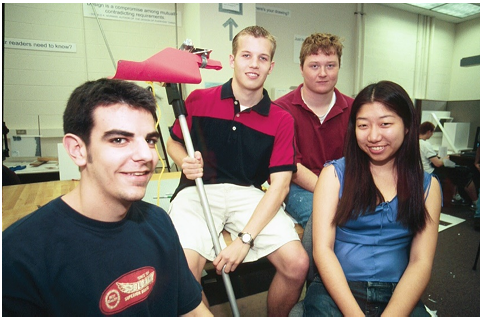
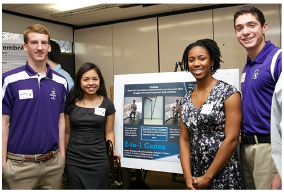
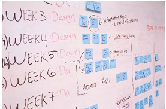
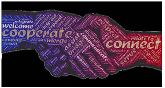
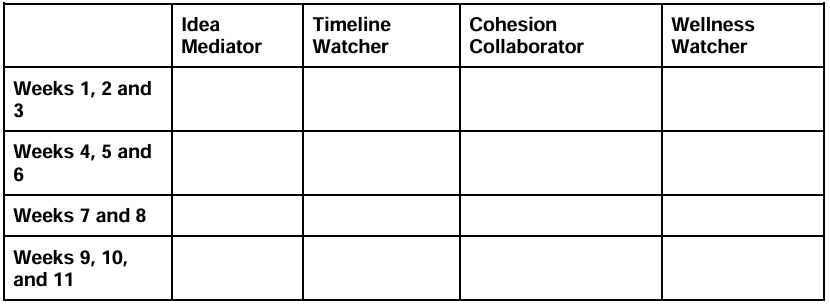
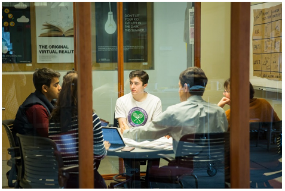
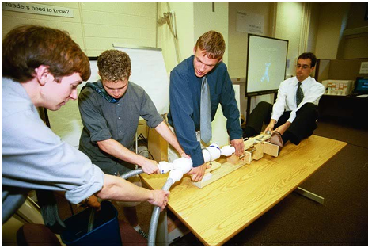

  # Teamwork in Design Thinking and Communication
  Composed by Kiki Zissimopoulos and Michele N. Zugnoni
  
  (Both authors contributed equally to this work.)

*With special thanks to Lisa Del Torto for conducting interviews*

Ver. 23 Aug 2020

*This work is licensed under the Creative Commons Attribution-NonCommercial 4.0 International License. To view a copy of this license, visit [http://creativecommons.org/licenses/by-nc/4.0/](http://creativecommons.org/licenses/by-nc/4.0/)*

*Or send a letter to Creative Commons, PO Box 1866, Mountain View, CA 94042, USA.*

# Navigation

[Introduction](#bookmark0)

[Our Approach to Teamwork and Problem Solving](#bookmark1)

[Team Roles](#bookmark2)

[Team Role Definitions](#bookmark3)

[Sharing Ideas](#bookmark4)

[Equitable Assignment of Work](#bookmark5)

[Developing a Communication Framework](#bookmark6)

[Managing Conflict](#bookmark7)

[Team Charters](#bookmark8)

[References](#bookmark9)

# Introduction

  *A team of design students poses with their prototype [^4].*
 
  Our primary teamwork goals for this class are for each of you to grow in your ability to equitably share team labor, provide self & peer assessment, and resolve team conflict. Our focus on growth will inherently require trial and error. Therefore, this class is an opportunity for you to discover, through direct experience, what behaviors, mindsets, and strategies lead to effective teamwork.
 
  When asked about the most important things learned in DTC and the most important takeaways, Joe Burke, a former design student, noted that, "I think, number one, for me\... will always be teamwork. Working effectively on a team and being able to not only work effectively but just exist in a positive space with other people in what sometimes might be a stressful environment. Building that cooperation and rapport with your team, I've learned, is so crucial to having a successful project." Joe goes on to say that, "\... it was overall a very positive experience for me because it was my first chance to work on a team closely with people and feel like I was actually doing the work I wanted to be doing\..."
 
  Our goal for this article is to provide you with strategies to navigate the process of working closely with a group of your peers who have different schedules, priorities, and strengths in order to create a positive team experience. Throughout the article, you'll find videos, which feature former design students expressing the lessons they learned that helped them achieve success in this course. In order to view these videos, be sure to download this pdf to your computer and have the latest update for Adobe Reader installed.

  

# Our Approach to Teamwork and Problem Solving

  In this class, you will be challenged to take supported risks. By 'supported' we mean that your instructors and peers will provide feedback to guide you through this process. At times, you will take on team responsibilities that require you to complete tasks that you've never done before. Sometimes, you may feel you aren't particularly well-suited to the tasks you're completing. You may feel that you aren't strong in that particular area.
 
  Rest assured, the tasks you will complete in this class will help you develop skills necessary to your success in design thinking and communication. Take advantage of the opportunity to complete these tasks in a lower-stakes environment. In this way, you will become better equipped to accomplish similar tasks in the future.
 
  Gretchen Vogt, a former design student, reflected on how this class pushed her out of her comfort zone by requiring her to present her work, and how she grew as a result: "It turned out that it felt like every single quarter there were at least one or two classes where I had to present \... I really appreciate that I had to do this ... because otherwise I would have been totally in over my head. The fact that \[this class\] forces you out of your comfort zone really prepares you for other classes that are also going to force you out of your comfort zone. So you really have to learn to get comfortable with being uncomfortable and \[this class\] helps with that." Gretchen recognized the opportunity to learn new skills in the supportive environment created by this class, and became stronger for it.

  *Design students present their project [^5].*
 
  In addition to learning new skills, you will also have opportunities to shine as you take on team responsibilities that enable you to tap into your strengths. In such cases, you will have the opportunity to refine your skill set and help others grow. Expertise is a life- long process; your skills and knowledge will grow with each experience. Amanda Davis, a former design student, discusses this spirit of growth in [this video.](https://youtu.be/drax57Wd_xE)

  
 
  **Team Roles**
 
  Depending on your instructors' directions, your team may rotate through various roles, as described below, so that each person has an opportunity to guide team development while also expanding their skill set. Each of these roles asks you to facilitate behaviors which foster effective teams. Each team member will hold every role for two or three weeks during the quarter. It is important that your team respects the boundaries of each role. If you are strong at a role that you are not currently assigned to, resist the temptation to take over for the team member who is assigned to this role. This is their opportunity to learn and your opportunity to model effective team behavior as you support them. By rotating roles and respecting the boundary of each role, you're enabling your team to leverage each member's strengths, as discussed by former design student, [Joe Burke](https://youtu.be/JbnRTV0IK4Y).

  

# Suggested Team Roles

## Idea Mediator

This teammate is responsible for advocating for ideas during brainstorming, and guarding against early judgement. This person makes sure each idea gets a fair shot. This person takes care to guard against group-think, ensuring that each idea is weighed for benefits and drawbacks.

  This person also makes sure that everyone understands the conversation, and that jargon isn't being used that might be understood differently by different people. This person checks in with other teammates to ensure everyone has had a chance to share their points-of-view and ideas.
 
  Finally, this person works with the Wellness Watcher to resolve any disputes that occur between team members.

## Timeline Watcher

  This teammate is responsible for updating and referencing the project management tools (i.e., Gantt chart, RAM chart, etc.). This person also keeps track of assignment due-dates and key milestones, ensuring that work is turned in on time. The person in this role should close each team meeting with a recap of what is done, what needs to be done, and any necessary timeline adjustments if needed.

  This person keeps the team on track.

## Cohesion Collaborator

  This person records notes during team meetings; client interactions; and presentations (i.e., such as comments from teachers and classmates). This person also shares these notes with all other teammates so that everyone is up-to-date with what's currently happening in terms of teamwork and project design. In addition, this person is responsible for communicating with external partners, such as clients and project partners, to complete tasks such as scheduling and email communications.

## Wellness Watcher

  This person is responsible for initiating discussions about dividing work, and ensures that work is divided equitably. They also keep track of how everyone's doing throughout the week, taking note if someone isn't feeling well or if someone is particularly busy, such as with midterm examinations or family responsibilities. In taking note, this person also keeps track of whether a busy team member has too many jobs assigned to them during that week, and shifts responsibilities so that other, less busy team members can help out. Finally, this person works with the Idea Mediator to resolve any disputes that occur between team members.
 
 Suggested Rotation Schedule Tool:

 

 

# Sharing Ideas

  *A team of design students meets to discuss their ideas [^2].*
 
  In this course, you will have many opportunities to share ideas with your team members. It's important to understand that every idea brings you closer to the solution you're hoping to achieve. As former design student Pravika Joshi notes, "It's really important that you give everyone's voice equal value\... \[W\]hether you think an idea is way out there should be even a consideration at that point. You should be letting people freely talk and think of the craziest ideas and giving those ideas equal weight as well."
 
  After you've listened to each team member's ideas, you'll need to consider both the strengths and weaknesses of each idea. An effective approach to sharing ideas within your team is to critique the idea, not the person. In the book, The Five Dysfunctions of a Team, Patrick Lencioni establishes the following pyramid [^3]. When sharing ideas, you'll want to guard against a fear of conflict. Viewpoint conflict is healthy, and research shows that diverse teams develop better results [^7]. In the [video below](https://youtu.be/HVRJhZMJNKs), former design student Melanie Galantino reflects on the value of not settling on an idea too early, and being open to sharing ideas.
 
  As you work with your team on developing ideas, you'll rely on the Idea Mediator for effective discussion. The person filling this role will help ensure that your team members listen to all ideas, which is important as you work to arrive at a final solution.

  

# Equitable Assignment of Work

  Just as you will rotate roles, it's also important to rotate responsibilities and tasks. The responsibilities in this class are varied, but include aspects of design and writing. You may find that you have strengths in one area or another, but in this class you will be called upon to take on tasks that may or may not involve one of your strengths. If you did a lot of writing in high school, for example, you will now be asked to take on tasks associated with design. The same is true in reverse: If you did a lot of design in high school, you are now asked to take on tasks associated with writing. As discussed above, the important thing in this course is giving yourself and your teammates the opportunity to grow. No one is an expert; we are all learning and developing our skills.
 
  As you assign work to your team members, you'll want to ensure that each team member takes on an equal amount of responsibility. In this way, you all function together as a team to accomplish your tasks. The Wellness Watcher, one of the team roles, can help you divide work equally between team members.

  *A design team works on their prototype [^1].*
 
  Also consider how you will manage time. Since you'll be working with a team, it's important that every member manage time in a way that helps them to complete the tasks they've been assigned. To ensure effective time management, you'll want to apply the tools you're given in your course, which may include GANTT charts and RAM charts. Also, consider what former design students [Boss Paspanthong and Amanda Davis](https://youtu.be/9fEY_UflzZU) have to say about time management in making your decision.
  
  

# Developing a Communication Framework

  As you begin to build rapport with your teammates, it's important to decide on how you will communicate. Some things to consider and work into a team charter are:

-   Will you communicate through email, text message, or social media?

    -   Be sure to choose one or two, then set up the parameters for communication. For example, if you intend to communicate through Facebook, you may want to download Facebook messenger onto your phone or create a Facebook page for your team. If you plan to communicate through email, you might want to create a group listserv.

-   How much time should your teammates take to respond? Generally, it's helpful to require teammates to respond in less than 24 hours from receipt of the message. However, if you're finalizing an assignment or on a deadline, you may want to shorten this length of time to 8 or 12 hours.

# Managing Conflict

  Should your team experience a dispute between team members, it's important to resolve that dispute in a way that empowers your team. The Wellness Watcher and Idea Mediator will serve as the team's mediators. Be sure to listen carefully to what each team member has to say, and then talk through the dispute in a way that ends with your team reaching a solution amenable to everyone.
 
  As you learn to work together with your team, consider that each member has a different background and experiences, which shape the way they communicate and view the world. It's important to take these differences into account when making decisions and communicating with your team members. Differences make us stronger; they are the foundation for team building.

# Team Charters

  Team charters are important for laying the groundwork and deciding how your team will function throughout the course. A team charter expresses the team\'s agreements on the following questions:

-   What's our mission? What will success look like?

-   What specific objectives do we need to reach to achieve success? And by when?

-   What resources (people, time, financial, equipment and processes) do we need?

-   What\'s the context of our work together? Who called us together and what do we know about that person's (or group's) expectations?

-   Who has authority to make what decisions? What decisions can individuals make? What decisions can be made by smaller teams? What decisions do we make together? What decisions do we need to have made by others? In answering these questions, you'll want to refer to the team roles, as discussed above.

-   What value do we place on conflict? How will the Idea Mediator and Wellness Watcher work together to resolve conflict in your group? For example, should they add an agenda item to the next meeting, call a separate meeting, etc.?

-   How will we know when we\'ve reached genuine agreement?

  To serve their purpose most effectively, team charters must be comprehensive and specific; as Matthieu and Rapp explain:
 
  Teams with high-quality charters are more likely to have thoroughly outlined member roles and interaction processes early on, so members can better concentrate on taskwork without pausing to debate issues already addressed in the team charter and can thereby perform better. To the extent that the charter is comprehensive, it should lay the foundation for a wide variety of circumstances that the team may confront (p. 92) [^6].
 
  Experience from design instructors is that successful teams use their team charter to hold each other accountable in six specific ways. Team members:

-   Arrive at meetings on time and ready to contribute

-   Agree on expectations, hold each other accountable, and reevaluate and track progress.

-   Communicate effectively with each other by exchanging information, having honest conversations, and equally distributing speaking time

-   Are humble and open to outside input. This includes hearing ideas and adopting feedback from others as well as trusting each team member.

-   Understand each other as people. Specifically, they know each team member's strengths and enable each person to play to their strengths, while also giving each person an opportunity to develop their skill sets. They understand what motivates each team member to want to contribute and excel.

-   Encourage each other to experiment, allowing everyone to learn from both success and failure.

  Your team charter consists of three main sections:

1.  **Mission:** This is identical to the mission statement in your project definition, as discussed in Chapter 3.

2.  **Performance Goals:** These identify the major objectives guiding the process the team will follow to achieve its mission with a high level of quality.

3.  **Team Standards:** These specify the behaviors and performance expectations the team will follow in its day-to-day functioning.

  The following team charter is neither comprehensive nor specific, so it is unlikely to help the team as the project proceeds and demands more of each member\'s time and effort: 
  
# Vague and Ineffective Team Charter

  **Mission:** We will design a system that enables people in wheelchairs to transfer to and from the leg press machine at RIC quickly and comfortably.
 
  **Performance goal:** Our mission is to fulfill the requirements of our project as set forth in the client\'s description provided to us at the start.

### Team Standards:

- Communication
 
- Use email to stay in touch. Be open-minded.
 
- Meetings
 
- Attend all meetings and be on time.
 
- Do everything possible to make the meetings productive. In particular, have a meeting agenda and stick to it.
 
- Everybody should participate in each meeting. All ideas should be respected.
 
- Dealing with disagreements
 
- Disagreements should be openly discussed until agreement is reached.
 
- Team Dynamics
 
- Have fun! Enjoy the process as much as possible.
  
- Track Tasks - Roles & Responsibilities Assign tasks evenly and fairly.
 
- Make sure to complete your assigned task on time.
 
- Intrinsic Motivation
 
- Each person should be sure to coordinate their personal goals with those of the entire team.
 
While the mission statement is clear, the performance goal sets only a minimal standard of achievement, and the team standards lack detail and leave important questions unaddressed, such as:

-   When and how often will the team meet? What happens if someone fails to attend or is consistently late?

-   Will all communication be conducted through email? If so, how often is it expected that team members will check their email and reply?

-   How will the team ensure that tasks are assigned evenly and fairly?

-   What happens if someone cannot or does not complete a task on time?

-   How will the team "have fun"?

-   Through what means will the team resolve disagreements?

  These are only a few of the gaps in this team charter. True, the team could address these gaps as they arise later in the project, but that would waste time and energy when they can least afford to do so. In such cases, experts find that the team is likely to "spend undue time grappling with teamwork issues that were not outlined initially and to suffer performance consequences" (Matthieu & Rapp, p. 92).
 
  Effective team charters can take different forms and emphasize different expectations and behaviors. The key is to schedule, at the start of the project, a meeting whose purpose is for you to discuss and agree on a specific and comprehensive charter that you feel confident will help you to become a high performance team.
 
  **For examples of two different but effective team charters, see Appendix K.**

### This article contains material taken from:

  Substantial parts of the section "Team Charters" are taken from *Design Thinking and Communication: Principles and Practice* by Yarnoff, C., Anderson, J., Ankenman, B., Benjamin, S., Bourgeois, M., Brown, D., Carmichael, K., Herrick, J., Hirsch, P., Shwom, B., and Wood, D., and are used under a [CC-BY-NC-SA 3.0 License](https://creativecommons.org/licenses/by-nc-sa/3.0/us/).

## Prepared by Kiki Zissimopoulos, PhD Ver. 29 Aug 2020

  This work is licensed under the Creative Commons Attribution-NonCommercial 4.0 International License.
 
  To view a copy of this license, visit [http://creativecommons.org/licenses/by-nc/4.0/](http://creativecommons.org/licenses/by-nc/4.0/) or send a letter to Creative Commons, PO Box 1866, Mountain View, CA 94042, USA.
 
  **BACKGROUND INFORMATION:**
 
  This activity is useful as an icebreaker and will work best in the first or second week of the quarter. It allows students to discuss their team behaviors in a neutral environment before any team interactions occur in DTC. The goal of this activity is for students to have an open, honest discussion on past teamwork experiences, and to self-reflect on their own teamwork tendencies. This self-disclosure will make discussions that may arise later in the quarter easier to initiate. This icebreaker will also fast-track the team's process in getting to know each other and help the team start to develop empathy for each other. It is important to note that while these behaviors are divided into two polarities to facilitate discussion, they probably operate on a continuum in reality.
 
  In addition to the prompt, three possible, non-exhaustive, options for implementation are below.

# Prompt for conducting activity

  **(***Activity Adapted from Brunt (1993). "Facilitation Skills for Quality Improvement." Quality Enhancement Strategies. 1008 Fish Hatchery Road. Madison WI 53715.**)***
 
  We all may exhibit both productive and less productive behaviors on teams. Under stress, our less helpful behaviors might start to dominate, so an awareness of our behaviors can help maintain positive team dynamics throughout the project. In reading through the Behavior Description list below, identify your single most constructive group behavior and your single most destructive group behavior.

# Instructor decides next Steps. Possible options for implementation:

1.  INDIVIDUAL REFLECTION: You may want each student to submit a reflection to you, the instructor.

  Reflection prompt: In a reflection to instructors, describe your constructive and destructive teamwork tendencies and the types of situations that trigger these behaviors. This exercise can be helpful for you to understand the team dynamics.

2.  AS REFERENCE MATERIAL: You may want to just provide this info as background material regarding different teamwork behaviors, as an FYI.

  The instructor may choose to provide just the descriptions as reference material and explain to students that these are different behaviors and tendencies that teammates might exhibit on teams. Even just prompting students to read the descriptions and think about the different ways people act on a team can be helpful.

3.  INDIVIDUAL REFLECTION + DISCUSSION: The instructor might assign an individual reflection that they submit only to you (i.e., #1 above) and then encourage students to self-disclose whatever they are comfortable sharing with their team. You may consider being present (virtually or otherwise) for this discussion so you can help facilitate.

  Reflection prompt: In a reflection to instructors, describe your constructive and destructive teamwork tendencies and the types of situations that trigger these behaviors. This exercise can be helpful for you to understand the team dynamics.
 
  Team assignment: In your first team meeting, share your behavior tendencies. By sharing with the members of your group, other teammates may draw upon constructive behavior and minimize destructive behavior as you work together.

# Behavior Descriptions

### Constructive

-   *Cooperating*: Is interested in the views and perspectives of other group members and willing to adapt for the good of the group.

-   *Clarifying*: Makes issues clear for the group by listening, summarizing, and focusing discussions.

-   *Inspiring*: Enlivens the group, encourages participation and progress.

-   *Harmonizing*: Encourages group cohesion and collaboration. For example, uses humor as relief after a particularly difficult discussion.

-   *Risk Taking*: Is willing to risk possible personal loss or embarrassment for the success of the overall group or project.

-   *Process Checking*: Questions the group on process issues, such as agenda, time frames, discussion topics, decision methods, and use of information.

### Destructive

-   *Dominating*: Uses most of the meeting time to express personal views and opinions. Tries to take control by use of power, time, and so on.

-   *Rushing*: Encourages the group to move on before the task is complete. Gets tired of listening to others and working with the group.

-   *Withdrawing*: Removes self from discussions or decision making. Refuses to participate.

-   *Discounting*: Disregards or minimizes group or individual ideas or suggestions. Severe discounting behavior includes insults, which are often in the form of jokes.

-   *Digressing*: Rambles, tells stories, and takes the group away from primary purpose.

-   *Blocking*: Impedes group progress by obstructing all ideas and suggestions ("That will never work because . . . ").

  Written by Kiki Zissimopoulos, PhD & Michele Zugnoni, PhD\
  (Both authors contributed equally to this work)
 
  Ver. 11 Sept. 2020

  This work is licensed under the Creative Commons Attribution-NonCommercial 4.0 International License. To view a copy of this license, visit <http://creativecommons.org/licenses/by-nc/4.0/  or send a letter to Creative Commons, PO Box 1866, Mountain View, CA 94042, USA.
 
  **Directions**
 
  Choose two of the scenarios, listed below, being careful to choose scenarios not already chosen by your team members. Read through the scenario, then respond by following these steps:
 
  **Step One.** Name the scenario you've chosen, and provide a brief summary of that scenario.
 
  **Step Two.** Answer the questions associated with the scenario. Also identify at least one thing you'd like your team to consider adding to your team charter, based on the scenario you've just completed.
 
  **Step Three.** Respond to each of your team members' posts, commenting on their responses to each scenario. In your comment (which should be at least one paragraph in length), respond on the following:

(a) Is there anything you would add to the answers your team member has given for each scenario?

(b) What parts of your team member's answer do you agree with? What parts do you disagree with?

(c) Consider the element your team member has suggested adding to your charter. Do you agree or disagree with this element? How would you like to see your team member's idea incorporated into your team charter?

# Scenarios

## Culture

  You are on a diverse team and you are noticing some interesting group dynamics. Jaival is constantly looking for ways to achieve consensus, work together, and make decisions based on what is best for the group, but is impatient when things do not come together. Another teammate, Jian, thrives on having the 'best idea', 'fastest response'. You suspect this person cares more about personal accolades than team health but has a lot of great ideas. Jian also does not care much for hierarchy, while Jaival is uncomfortable unless he understands team hierarchy. Jenny, a third team member, suspects that her teammates have different views of power and individualism, and is concerned about the health of the team, but she is not sure how to address her concerns with her team members.

1.  You are the fourth member of this team. What might you have discussed in the first week of working together to understand each teammate's expectations?

2.  How would you address this situation with each of your team members in a way that ensures the health of your team?

## Deadlines

  You have been working on a team for about three weeks and you are noticing that one of your teammates, Jaime, is becoming increasingly frustrated. Jaime has commented that they feel like the weight of the team is on their shoulders and they feel that they are doing more work than the rest of the team. From your perspective, Jaime does not leave much space for others to do work. For example, last week an assignment was due on Thursday at noon. Jaime worked ahead and sent a draft to the team on Tuesday evening, expecting the team to be finished by 5pm on Wednesday evening. You know that DeShawn, another teammate, likes to finalize assignments the night before they are due. DeShawn has high standards and wants to make sure the team uses all the time available to them.

1.  What could your team have done differently in week 1 to prevent this scenario? What should they do now, in the moment, and to prevent this from happening in the future?

2.  What are all the possible factors that might be contributing to the different approach to deadlines for Jaime and DeShawn? Do you recognize yourself in this scenario? If so, how?

## Organization

  A group has members that represent different organizational styles. Frankie is very organized and good at developing a team-based organizational structure, but doesn't seek input from teammates about this organizational structure and gets frustrated with others who aren't so organized; Antonio is action-oriented and keeps a list of things that need to be done, but has difficulty remembering to share these "to do" items with his teammates by placing them into the team's organizational structure; Emily comes up with great ideas and is good at motivating teammates, but develops and follows her own individualized organizational structure; and Wei is good at digging for answers and coming up with solutions, but doesn't really follow any organizational structure. As a result of these conflicting organizational structures, the team is having difficulty meeting and coming up with any ideas, and they have missed several deadlines.

1.  As a member of this team, what guidelines might you put into place during the first week of working together in order to account for each team member's organizational differences?

2.  During the fifth week of term, you begin to notice that these differences are creating a problem with team dynamics. What guidelines might you put into place now to resolve these issues?

3.  Have you ever experienced a situation like this? What did you do?

## Dedication

  Your team is preparing for a design review (which is where you present your progress to a panel for feedback) and, as with most group meetings, Garima is late and might not even show up. You are worried that Garima does not understand the project and will not be able to answer questions during the design review. You are also frustrated because your team is essentially a three-person team at this point, and there is enough work for four people. Garima would reply early in the quarter and had agreed on the team meeting times. In fact, Garima was even the one to suggest using Slack and chose the meeting time but lately it seems like this project is not a priority for her. She will occasionally contribute, and has good ideas, when present...

1.  Pretend that you're a member of this team. What might your team have done during the first week of the quarter to avoid this situation?

2.  Have you ever experienced this on a team before? Was your team able to improve contributions of all teammates? If not, what would you have done differently?

3.  What do you think might be going on with Gabe? As a member of this team, how would you approach Gabe?

## POV

  Maya is, once again, sitting with arms crossed rolling her eyes. Ever since the first brainstorming session she latched onto a solution and considered the decision made. She doesn\'t see the point considering other alternatives, because the original idea is 'perfect' because she's tried it before, and knows that it works. She thinks the team is wasting time by thinking outside the box and considering alternatives. She says she's busy this quarter and prefers to just run with the first idea the team came up with. John is concerned that Maya's idea of choice doesn't meet all the client's requirements and would like to consider other ideas. John is willing to take risks if it means meeting the client's requirements. There are a lot of tense conversations between the two and you worry that instead of moving forward, the team is now stuck in a "Maya vs. John" idea competition.

1.  Have you ever been in a situation like this? What do you think is leading to each team members' perspectives?

2.  If you were asked to mediate the disagreement (you are not on the team) what would you do? How could you get the team into a more objective space and away from personalizing the ideas?

3.  It's difficult to predict when this might happen on a team. Can you think of ways to create a team culture that minimizes the ability of one person to shut down and commit to a single idea too early in the process?

## In the Quiet

  In this team of four, team members have various approaches to sharing ideas. Richelle is outgoing and vocal, and eager to share each of her ideas. Gunnar is reflective and takes time to consider ideas before sharing them. Rabiah is nervous about her ideas, and hesitant to share them with others. Santiago is eager to share his ideas but is very quiet and has difficulty finding a time to share because other members of the group are more vocal.

1.  As a member of this team, what are some guidelines you might set at the beginning to ensure that everyone has a chance to share and participate?

2.  In the middle of the term, you discover that some of your team members have great ideas that they never shared. As a result, your team has lost the opportunity to incorporate those ideas into their design. What might you do to ensure those ideas are heard now and that they're incorporated into your design?

3.  Have you ever been a part of a team where certain ideas were shared and others were kept quiet? How did you handle the situation?

## Roles

  A team has members with diverse high school backgrounds. Kory took AP courses and worked closely with his teachers to get personalized feedback on his writing. Katarina excelled at shop and worked in the school's maker space. Elijah went to a high school that didn't offer these opportunities, but he focused on many extracurricular activities.
 
  Malia worked 20 hours per week at a part-time job to help support her family. In this class, some assignments require elements of design; some require elements of writing; and some require elements of writing and design. This team must decide which team member to assign to each assignment, knowing that this project offers the opportunity to learn and grow and perhaps try new things.

1.  How might you assign work during week one to ensure that each team member receives an equitable amount of work?

2.  In one scenario, the team assigns Katarina to complete the design elements and Kory to complete the writing elements, knowing that each student excels in these areas. In another scenario, the team assigns Kory to complete the design elements and Katarina to complete the writing elements. What are the implications for this assignment of roles? What are the implications for other configurations of role assignments?

3.  In one scenario, the team assigns Katarina to complete the design elements and Kory to complete the writing elements, knowing that each student excels in these areas. In another scenario, the team assigns Kory to complete the design elements and Katarina to complete the writing elements. In each scenario, Katarina and Kory become disgruntled with their assignments, wanting to branch out and try different assignments. What actions might you have taken during week one to avoid this situation?

## Power Play

  Your team started off on such a positive note! In the first few weeks everyone was contributing. However, lately you've noticed a disturbing trend with one team member in particular. Marsha has started taking over other teammates' roles, and exerts more and more power each week. In every meeting she is the first to speak and she takes up most of the meeting time. The other day, she sent the agenda for the weekly meeting even though Basha is supposed to have that task this week. Last week, Marsha was supposed to be the time keeper, but she forgot. Your team had discussed, and agreed on, team roles during the initial team meeting but as the quarter becomes more and more stressful Marsha seems to be defaulting to a do-it-all approach and not letting other team members have an opportunity to contribute.

1.  Have you ever experienced this on a team? If so, did you find a solution that worked? If not, suggest some things the team could try in the moment to redistribute the work.

2.  What additional steps, besides just deciding on roles, do you think the team might have taken at the beginning to ensure that everyone has a chance to participate and share their ideas?

  Written by Kiki Zissimopoulos, PhD & Michele Zugnoni, PhD\
  (Both authors contributed equally to this work)
  Ver. 11 Sept. 2020

  This work is licensed under the Creative Commons Attribution-NonCommercial 4.0 International License. To view a copy of this license, visit <http://creativecommons.org/licenses/by-nc/4.0/  or send a letter to Creative Commons, PO Box 1866, Mountain View, CA 94042, USA.
 
  **Overview**
 
  These reflections were created for Design Thinking and Communication at Northwestern University. Each reflection has a suggested forum (i.e., quiz, discussion board), but they can be assigned on whichever forum the instructor feels best fits their course. These reflections are formed around Phil Daniel's stop-start-continue format [^8].
 
# Reflection Set One

### Quiz
Thinking back on the client interview and/or the initial team presentation, how did your team divide up tasks? Did this division foster equitable distribution of work? How or how not? What might you have done differently to ensure that each team member had an equitable role?

### DISCUSSION BOARD (divided by groups):

  Step One. Now that you've had a chance to reflect on your team's distribution of roles, write and post a comment in which you discuss:

(a) In terms of diving roles up equitably, what do you hope your team stops doing?

(b) In terms of dividing roles up equitably, what do you hope your team starts doing?

(c) In terms of dividing roles up equitably, what do you hope your team continues doing?

  Step Two Read and respond to each comment posted by your team members.
 
  Step Three. Together with your team, decide on at least one answer for each of the following questions. Post your response to this discussion board.

(a) What will your team stop doing?

(b) What will your team start doing?

(c) What will your team continue doing?

### INDIVIDUAL REFLECTION: 
Over the last few days, you and your team have had a chance to reflect on and discuss your team's distribution of roles for the client interview
 
  and/or initial research presentation. Take a moment now to reflect and write a response of at least 200 words on the following: (a) What went well? (b) How comfortable are you with the decisions your team made on things you will stop, start and continue doing? (c) What additional things do you wish your team would stop, start and continue doing? (d) How might you present these additional things to your team to ensure they happen?
 
  NOTE: In forming your response to item "d," you may wish to rewatch the videos on Communicating in Teams and Handling Conflict \[insert link to videos\]. You may also review the chapter on [teamwork](#bookmark1). Your response will only be visible to you and your instructors.
 
# Reflection Set Two
 
### QUIZ: 
What ideas have you personally thought of for your design? Have you been able to share your ideas with your teammates? Have your teammates shared their ideas?
 
  Have each of your team members been receptive to ideas? How or how not?

### DISCUSSION BOARD (divided by groups):

  Step One. Now that you've had a chance to reflect on the environment of idea sharing within your team, write and post a comment in which you discuss:

(a) To ensure that everyone's ideas are shared and heard, what do you hope your team stops doing?

(b) To ensure that everyone's ideas are shared and heard, what do you hope your team starts doing?

(c) To ensure that everyone's ideas are shared and heard, what do you hope your team continues doing?

  Step Two. Read and respond to each comment posted by your team members.
 
  Step Three. Together with your team, decide on at least one answer for each of the following questions. Post your response to this discussion board.

(a) What will your team stop doing?

(b) What will your team start doing?

(c) What will your team continue doing?

### INDIVIDUAL REFLECTION: 
Over the last few days, you and your team have had a chance to reflect on and discuss the environment of idea sharing within your team. Take a moment now to reflect and write a response of at least 200 words on the following: (a) What went well? (b) How comfortable are you with the decisions your team made on things you will stop, start and continue doing? (c) What additional things do you wish your team would stop, start and continue doing? (d) How might you present these additional things to your team to ensure they happen? NOTE: In forming your response to item "d," you may wish to rewatch the videos on Communicating in Teams and Handling Conflict \[insert link to videos\]. You may also review the chapter on teamwork \[insert link to chapter\]. Your response will only be visible to you and your instructors.
 
# Reflection Set Three
 
### QUIZ: 
How did your team distribute the work and the presentation? Do you think this approach accurately reflected the work that each individual contributed? Would you have done anything differently?

### DISCUSSION BOARD (divided by teams):

  Step One. Now that you've had the chance to reflect on your team's distribution of work, write and post a comment in which you discuss:

(a) To ensure that everyone has an equal understanding of the elements of the project, what do you hope your team stops doing?

(b) To ensure that everyone has an equal understanding of the elements of the project, what do you hope your team starts doing?

(c) To ensure that everyone has an equal understanding of the elements of the project, what do you hope your team continues doing?

  Step Two. Read and respond to each comment posted by your team members.
 
  Step ThreeTogether with your team, decide on at least one answer for each of the following questions. Post your response to this discussion board.

(a) What will your team stop doing?

(b) What will your team start doing?

(c) What will your team continuedoing? 

### INDIVIDUAL REFLECTION: 
Over the last few days, you and your team have had a chance to reflect on and discuss your team's distribution of work. Take a moment now to reflect and write a response of at least 200 words on the following: (a) What went well?
 
  \(b\) How comfortable are you with the decisions your team made on things you will stop, start and continue doing? (c) What additional things do you wish your team would stop, start and continue doing? (d) How might you present these additional things to your team to ensure they happen? NOTE: In forming your response to item "d," you may wish to rewatch the videos on Communicating in Teams and Handling Conflict \[insert link to videos\]. You may also review the chapter on teamwork \[insert link to chapter\]. Your response will only be visible to you and your instructors.

  

# References

[^1]:  DTC Fair Dec. 7. Photographed by McCormick School of Engineering, Northwestern University.

[^2]:  DTC Small Group Meeting. Photographed by McCormick School of Engineering, Northwestern University.

[^3]:  Lencioni, P. "The five dysfunctions of a team." *The Organizational Health People*: *The Table Group*. Accessed 8/22/20 from [[https://www.tablegroup.com/download/the-five-dysfunctions-model-and-]{.underline}](https://www.tablegroup.com/download/the-five-dysfunctions-model-and-summary/) [[summary/]{.underline}](https://www.tablegroup.com/download/the-five-dysfunctions-model-and-summary/)

[^4]:  Presentations (Photo 1). Photographed by McCormick School of Engineering, Northwestern University.

[^5]:  Presentations (Photo 9). Photographed by McCormick School of Engineering, Northwestern University.

[^6]:  J. Matthieu and T. Rapp. "Laying the foundation for successful team performance strategies: The roles of team charters and performance strategies." *Journal of Applied Psychology*, vol. 94.1, pp. 90-103, Jul. 2010, doi: 10.1037/a0013257.

[^7]:  J. Wang, G. H.-L. Cheng, T. Chen, and K. Leung. \"Team creativity/innovation in culturally diverse teams: A meta‐analysis.\" *Journal of Organizational Behavior,* vol. 40.6, pp. 693-708, Feb. 2019, doi: 10.1002/job.2362.
  
[^8]:  DeLong, T.J. (2011, Aug 4). Three questions for effective feedback. *Harvard Business Review*. https://hbr.org/2011/08/three-questions-for-effective-feedback

    *\*All other photos are part of the public domain.*
